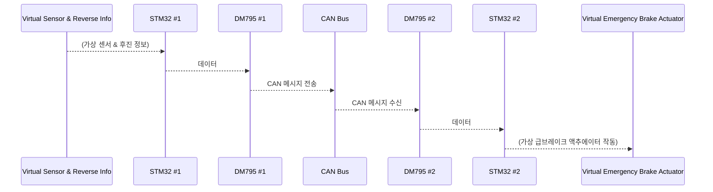
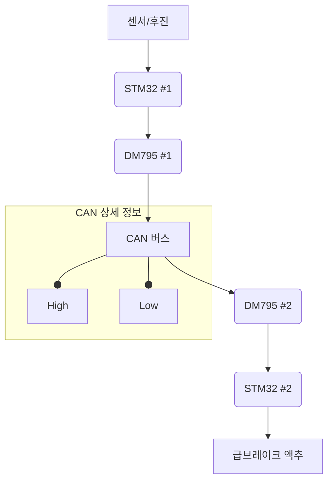

# HukBrake : CAN 통신 기반 후진 자동 급브레이크 시스템

## **1. 프로젝트 개요**

본 프로젝트는 STM32 마이크로컨트롤러와 CAN (Controller Area Network) 통신을 활용하여 후진 시 갑작스럽게 나타나는 장애물을 포함하여 일정 거리 이내에 장애물이 감지되면 자동으로 급브레이크가 작동하는 시스템을 시뮬레이션하는 것을 목표로 합니다. RTOS (Real-Time Operating System)를 사용하여 차량의 전후진 파킹 등 기어 정보와 후방 거리 센서 정보를 실시간으로 확인하고, 이를 기반으로 자동 급브레이크 기능을 구현합니다. 이를 통해 임베디드 시스템 기반의 차량 안전 기능 개발 원리를 이해하고, CAN 통신, RTOS 활용, 마이크로컨트롤러 프로그래밍 능력을 향상시키는 것을 목표로 합니다.

## **2. 프로젝트 목적**

본 프로젝트의 주요 목적은 다음과 같습니다.

* STM32 마이크로컨트롤러를 활용한 임베디드 시스템 개발 능력 습득.
* 차량 내 통신 프로토콜인 CAN 통신의 기본 원리 및 구현 방법 이해.
* RTOS를 활용하여 실시간으로 차량 기어 정보 및 센서 데이터를 처리하는 방법 학습.
* 후진 센서 정보 및 거리 센서 정보를 CAN 메시지를 통해 송수신하는 방법 학습.
* 갑작스러운 장애물 출현 상황을 포함하여 특정 조건 (후진 상태 및 근접 거리) 만족 시 자동 급브레이크 기능을 시뮬레이션하는 로직 구현.
* 이벤트 기반 아키텍처를 이해하고 적용하여 시스템의 효율적인 동작 구현.

## **3. 기술 스택**

본 프로젝트에 사용될 주요 기술 스택은 다음과 같습니다.

* **마이크로컨트롤러:** STM32 개발 보드 (2개)
* **통신 프로토콜:** CAN (Controller Area Network)
* **CAN 트랜시버:** DM795 (2개)
* **운영체제:** RTOS (FreeRTOS)
* **프로그래밍 언어:** C/C++
* **개발 환경:** STM32CubeIDE
* **선택 사항:** UART (디버깅 및 시스템 상태 확인)

## **4. 구현 방법**

본 프로젝트는 두 개의 STM32 개발 보드를 사용하여 구현되며, RTOS를 적극적으로 활용하여 실시간성을 확보합니다.

* **하드웨어 구성:**
    * **송신 측 (시뮬레이터):**
        * STM32 개발 보드 #1
        * DM795 #1 CAN 트랜시버
        * 기어 정보 시뮬레이션: 다수의 푸시 버튼 또는 로터리 스위치를 STM32 #1의 GPIO 핀에 연결하여 전진, 후진, 주차 등의 기어 상태를 입력합니다.
        * 거리 센서 시뮬레이션: 가변 저항을 STM32 #1의 ADC 핀에 연결하여 거리 변화를 흉내 내거나, 미리 정의된 거리 값을 사용합니다.
    * **수신 측 (자동 급브레이크):**
        * STM32 개발 보드 #2
        * DM795 #2 CAN 트랜시버
        * 급브레이크 시뮬레이션: LED 또는 부저를 STM32 #2의 GPIO 핀에 연결하여 급브레이크 작동을 시각적으로 또는 청각적으로 표현합니다.
    * **CAN 버스 연결:** DM795 #1과 DM795 #2의 CAN High (CANH) 및 CAN Low (CANL) 핀을 서로 연결하여 CAN 통신 버스를 구성합니다. 각 트랜시버는 각각의 STM32 보드에 연결됩니다.

* **소프트웨어 구현:**
    * **송신 측 STM32 (#1):**
        * **RTOS Task:**
            * 기어 상태를 주기적으로 읽어 CAN 메시지로 전송하는 Task를 생성합니다.
            * 거리 센서 값을 주기적으로 읽어 CAN 메시지로 전송하는 Task를 생성합니다.
    * **수신 측 STM32 (#2):**
        * **RTOS Task:**
            * CAN 인터럽트를 통해 CAN 메시지를 수신하고, 메시지 ID를 확인하여 기어 상태와 거리 정보를 추출하는 Task를 생성합니다.
            * 추출된 기어 상태를 실시간으로 확인하고, 후진 상태이며 거리가 임계값 이하이면 급브레이크 시뮬레이션 출력을 활성화하는 Task를 생성합니다. 이 Task는 갑작스러운 장애물 출현 상황에 대한 빠른 반응을 위해 높은 우선순위를 가질 수 있습니다.
    * **아키텍처:** RTOS 기반의 이벤트 기반 아키텍처를 사용합니다. 각 기능은 독립적인 Task로 구현되어 실시간으로 동작하며, CAN 메시지 수신은 인터럽트를 통해 처리됩니다. Task 간 통신을 위해 Queue 또는 Semaphore 등의 RTOS 기능을 활용할 수 있습니다. UART를 사용하여 시스템 상태를 모니터링하고 디버깅합니다.

## **5. 데이터 흐름도**

## **6. 시사점**

* 실제 차량의 복잡한 시스템을 간소화하여 임베디드 시스템 기반 안전 기능 개발의 핵심 원리를 이해할 수 있습니다.
* CAN 통신을 활용한 분산 시스템 설계 및 실시간 데이터 교환 방식을 학습하고, 실제 차량 네트워크의 기초를 다질 수 있습니다.
* RTOS를 이용하여 여러 센서 데이터를 실시간으로 처리하고, 우선순위에 따른 Task 관리를 통해 시스템의 응답성을 향상시키는 방법을 익힐 수 있습니다.
* STM32 마이크로컨트롤러의 다양한 주변 장치 (GPIO, ADC, CAN) 사용법을 숙달하고, 임베디드 시스템 개발 능력을 향상시킬 수 있습니다.
* 갑작스러운 상황 발생 시 실시간으로 대응하는 안전 시스템 설계의 어려움과 중요성을 체감할 수 있습니다.
* 가상 환경에서의 시뮬레이션을 통해 실제 차량 적용 전에 발생할 수 있는 다양한 문제점을 예측하고 해결하는 능력을 배양할 수 있습니다.
