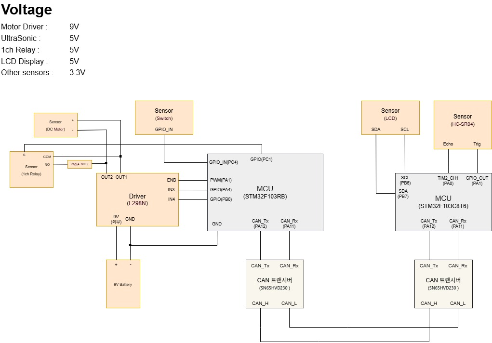
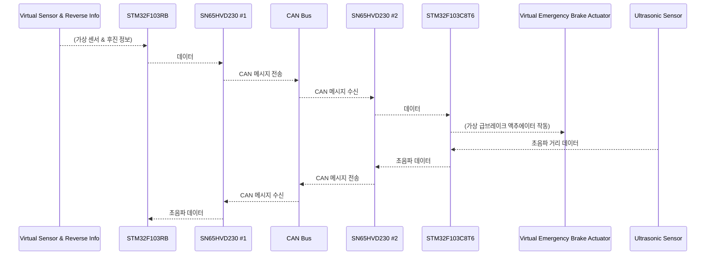
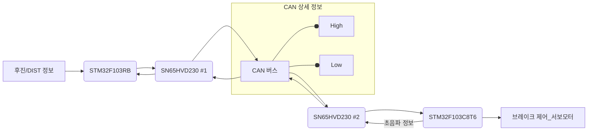
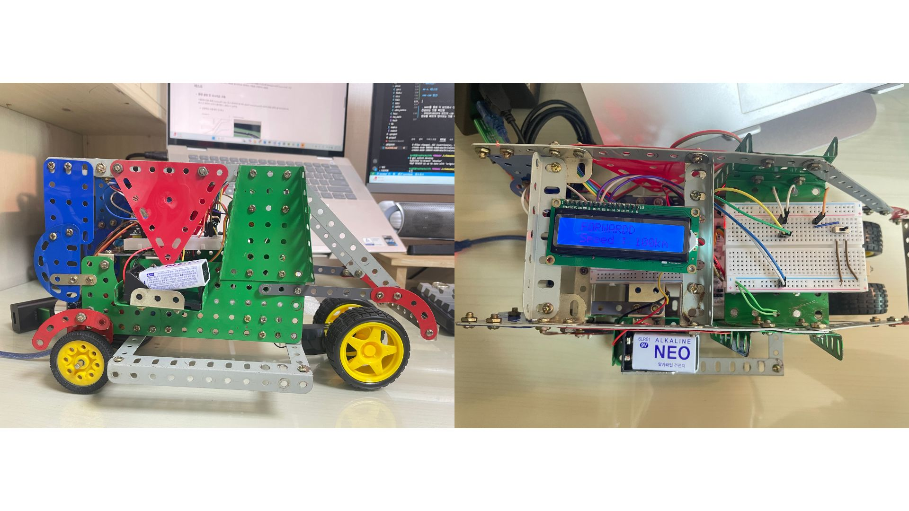
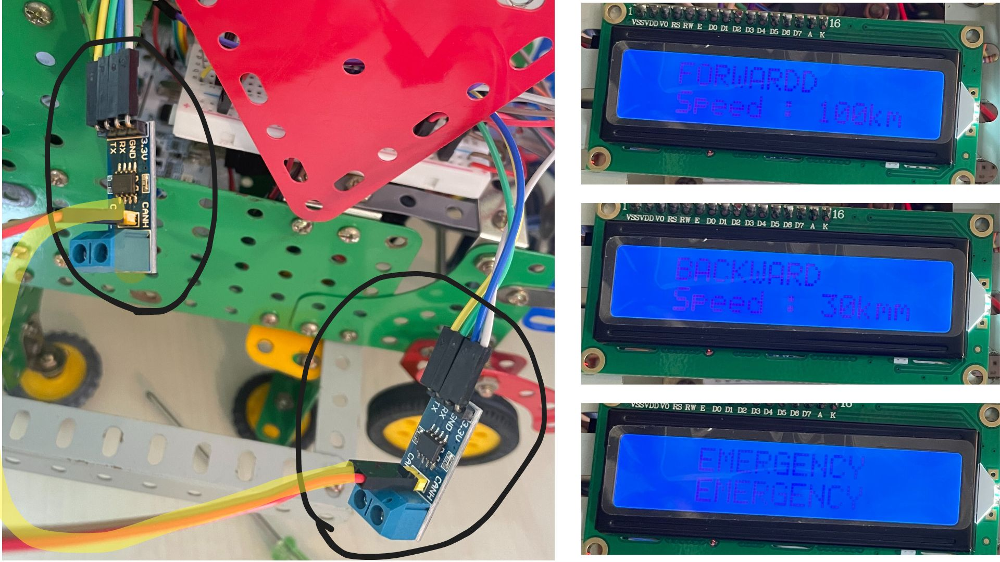

# HukBrake : CAN 통신 기반 후진 자동 급브레이크 시스템

## **1. 프로젝트 개요**

본 프로젝트는 STM32 NCU와 CAN 통신을 활용하여 후진 시 갑작스럽게 나타나는 장애물을 포함하여 일정 거리 이내에 장애물이 감지되면 자동으로 급브레이크가 작동하는 시스템을 시뮬레이션하는 것을 목표로 한다. RTOS (Real-Time Operating System)를 사용하여 센서 정보를 실시간으로 확인하고, 이를 기반으로 자동 급브레이크 기능을 구현한다.

CAN 통신으로 구현하였기 때문에 추후 OBD-2를 통해 후진 정보에 대한 CAN ID를 알 수 있다면, 실제 차량에 충분히 적용이 가능하다.

## **2. 프로젝트 목적**

* 2개의 STM32 보드를 활용한 임베디드 시스템 개발 능력 습득.

* 차량 내 통신 프로토콜인 CAN 통신의 기본 원리 및 구현 방법 이해.
* RTOS를 활용하여 실시간으로 차량 기어 정보 및 센서 데이터를 처리.
* 후진 센서 정보 및 거리 센서 정보를 CAN 메시지를 통해 송수신하는 방법 학습.
* 갑작스러운 장애물 출현 상황을 포함하여 특정 조건 (후진 상태 및 근접 거리) 만족 시 자동 급브레이크 기능을 시뮬레이션하는 로직 구현.

## **3. 기술 스택 / 프로젝트 기간**

<strong>프로젝트 기간</strong> : 2025년 4월 14일 ~ 2025년 5월 14일 (5주)

|**TECH**|**STACK**|
|:---:|:---:|
|MCU| STM32F103RB, STM32F103C8T6|
|통신 프로토콜| CAN, UART, I2C, PWM|
|CAN 트랜시버| SN65HVD230 (2개)|
|OS|RTOS (FreeRTOS)|
|Language| C|
|Tools|STM32CubeIDE|

## **4. 구현 방법**

### 하드웨어 구성:

 

* ✅ **STM32F103RB:**

    * 기어 정보 시뮬레이션: 다수의 푸시 버튼 또는 로터리 스위치를 STM32F103RB의 GPIO 핀에 연결하여 전진, 후진 상태를 입력.

    * 거리 센서 시뮬레이션: STM32F103C8T6 보드에서 측정한 초음파 센서 정보를 지속적으로 받아옴.

* ✅ **STM32F103C8T6:**

    * 급브레이크 시뮬레이션: LCD Display를 STM32F103C8T6의 GPIO 핀에 연결하여 급브레이크 작동을 시각적으로 표현.

    * 초음파 센서를 연결하여 지속적으로 거리 정보를 확인.

* **CAN 버스 연결:** SN65HVD230 #1과 SN65HVD230 #2의 CAN High (CANH) 및 CAN Low (CANL) 핀을 서로 연결하여 CAN 통신 버스를 구성. 각 트랜시버는 각각의 STM32 보드에 연결됨.

### 소프트웨어 구현:
* ✅ **STM32F103RB:**
    - **RTOS Task**
        - **초음파 센서 캡처 및 모터 제어 데이터 송신 Task**  

            - 모터의 상태(예: 속도, 방향 등)를 주기적으로 읽고 CAN 메시지로 전송.

            - 초음파 센서 데이터를 주기적으로 캡처하여 내부 저장소에 업데이트하거나, 이후 요청에 대비.

* ✅ **STM32F103C8T6:**
    - **RTOS Task**
        - **CAN 수신 및 LCD 출력 Task**  

            - CAN 인터럽트를 통해 수신된 메시지를 확인하고, 모터 제어 데이터를 추출하여 LCD에 출력.
        - **초음파 데이터 송신 Task**  

            - 초음파 센서 데이터를 CAN 메시지로 변환하여 송신 측 STM32 (#1)로 전송.

### 아키텍처
- **RTOS 기반 이벤트 중심 구조**를 채택.

- 각 기능은 **독립된 Task**로 설계되어 병렬적으로 동작.
- **CAN 메시지 수신은 인터럽트 기반**으로 처리되어 실시간 반응성을 보장.
- Task 간 통신은 **Queue**, **Semaphore**, 또는 **Event Group**을 통해 관리.
- **UART** 또는 **LCD 디스플레이**를 통해 시스템 상태를 실시간으로 모니터링.

## **5. 데이터 흐름도**

시퀀스 다이어그램

 

플로우 차트

## 6. 테스트

### 차량 사진

  

     
    
차량 전체 사진

  

### CAN 통신 

- UART를 통해 각 보드에서 데이터가 실시간으로 전송되는 것을 확인하였으며, 오차없이 빠르게 전송되는 것을 확인함.

- STM32F103C8T6 보드의 LCD Display를 통해 STM32F103RB 보드에서 전송한 전/후진 정보와 속도 정보를 빠르게 받아오는 것을 확인함.

### 모터 제어

- 실제로 사용되는 차량의 전자 브레이크를 구현하고자 **단락 제동**과 **다이나믹 제동**을 사용.

    - 단락 제동 : 모터 드라이버에서 방향을 나타내는 두 신호(IN3, IN4)를 같게 설정.

        - 모터드라이버의 방향 제어 센서에 LOW, LOW 아니면 HIGH, HIGH
    - 다이나믹 제동 : 릴레이 센서를 통해 전력을 차단.
        - 릴레이 센서와 모터드라이버 전원을 연결해주어 연결 끊어주는 것임

1. **정상 작동** : STM32는 릴레이 제어 신호 핀(S)을 LOW로 유지하여 릴레이가 작동하지 않도록 함. 이때 릴레이의 COM 핀은 NO 핀과 분리되어 있고 NC 핀과 연결되어 있지만, NC 핀은 사용하지 않으므로 모터는 L298N의 OUT1을 통해 전원을 공급

2. **제동 시** : STM32는 초음파 센서로부터 위험 거리가 감지되면 다음 단계를 수행

    - L298N의 ENA 핀을 LOW로 설정하여 모터에 공급되는 PWM 신호를 차단하고 모터를 정지

    - 릴레이 제어 신호 핀(S)을 HIGH로 설정하여 릴레이를 작동
    - 릴레이가 작동하면 COM 핀이 NO 핀으로 전환되어 DC 모터는 L298N의 OUT1 연결이 끊어지고, 대신 제동 저항의 한쪽 끝에 연결. 모터의 다른 쪽 끝은 L298N의 OUT2에 연결되어 있다.
    - 모터는 회전하면서 발전기처럼 작동하고, 발생된 역기전력으로 인해 전류가 제동 저항과 L298N의 내부 회로를 통해 흐르면서 운동 에너지가 열로 소모되어 빠르게 감속됨
3. **제동 해제** : 제동이 완료되면 STM32는 릴레이 제어 신호 핀(S)을 다시 LOW로 설정하여 릴레이를 비활성화한다. COM 핀은 다시 NC 핀으로 돌아가지만, NC 핀은 사용하지 않으므로 모터는 L298N의 OUT1과 연결되지 않은 상태가 된다. 정상적인 모터 작동을 재개하려면 L298N의 ENA 핀을 HIGH로 설정해야 함

모터 제어 관련 회로도 다이어그램(text)

    STM32 핀:
    - 디지털 출력 (IN1) ---> L298N 핀 7
    - 디지털 출력 (IN2) ---> L298N 핀 5
    - PWM 출력 (ENA) ---> L298N 핀 6
    - 디지털 출력 (릴레이 제어 - S) ---> 릴레이 센서 핀 S
    - 5V 출력 ---> 릴레이 센서 핀 VCC, L298N 핀 8
    - GND ---> 릴레이 센서 핀 GND, L298N 핀 4, 6, 11, 13, 외부 전원 공급 장치 (-)

    L298N 모터 드라이버:
    - 핀 9 또는 12 (VCC) ---> 외부 전원 공급 장치 (+)
    - 핀 2 (OUT1) ---> 릴레이 센서 핀 COM
    - 핀 3 (OUT2) ---> 제동 저항 (다른 쪽 끝)

    릴레이 센서 (1채널):
    - 핀 COM ---> L298N 핀 2 (OUT1)
    - 핀 NO ---> 제동 저항 (한쪽 끝)
    - 핀 NC ---> 연결 안 함
    - 핀 GND ---> STM32 GND
    - 핀 S ---> STM32 디지털 출력 (릴레이 제어)
    - 핀 VCC ---> STM32 5V 출력

    제동 저항:
    - 한쪽 끝 ---> 릴레이 센서 핀 NO
    - 다른 쪽 끝 ---> L298N 핀 3 (OUT2)

    DC 모터:
    - 한쪽 단자 ---> 릴레이 센서 핀 COM (L298N OUT1을 통해 연결)
    - 다른 쪽 단자 ---> L298N 핀 3 (OUT2)

    외부 전원 공급 장치:
    - (+) ---> L298N 핀 9 또는 12 (VCC)
    - (-) ---> L298N 핀 4, 6, 11, 13, STM32 GND

    5V 전원 (STM32):
    - (+) ---> 릴레이 센서 핀 VCC, L298N 핀 8
    - (-) ---> STM32 GND

## **7. 시연 영상**

<table>
  <tr>
    <td></td>
    <td></td>
  </tr>
  <tr>
    <td style="text-align: center;"><strong>Emergency Brake 작동</strong></td>
    <td style="text-align: center;"><strong>후진 중 모터 동작</strong></td>
  </tr>
</table>
